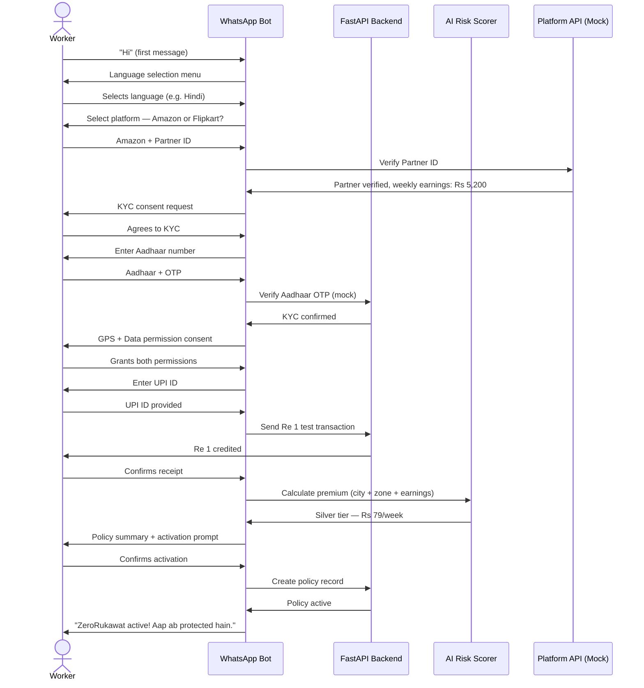

# ZeroRukawat — Zero Disruption to Your Earnings

> **AI-Powered Parametric Income Insurance for E-Commerce Delivery Partners**
> Protecting Amazon & Flipkart delivery partners from income loss caused by external disruptions — automatically, instantly, and without any claim filing.

---

## Table of Contents

1. [The Problem](#1-the-problem)
2. [Our Solution](#2-our-solution)
3. [Target Persona & Scenarios](#3-target-persona--scenarios)
4. [Weekly Premium Model](#4-weekly-premium-model)
5. [Parametric Triggers](#5-parametric-triggers)
6. [Platform Choice & Justification](#6-platform-choice--justification)
7. [AI / ML Integration](#7-ai--ml-integration)
8. [Language Support](#8-language-support)
9. [Tech Stack](#9-tech-stack)
10. [System Architecture](#10-system-architecture)
11. [WhatsApp Bot Flow](#11-whatsapp-bot-flow)
12. [Fraud Detection System](#12-fraud-detection-system)
13. [Business Model & Sustainability](#13-business-model--sustainability)
14. [Development Roadmap](#14-development-roadmap)
15. [Deliverables by Phase](#15-deliverables-by-phase)
16. [Limitations & Known Gaps](#16-limitations--known-gaps)
17. [Team](#17-team)

---

## 1. The Problem

India has over **12 million gig delivery workers**. Amazon and Flipkart delivery partners operate on a **batch slot system** — they are assigned a morning batch (8am–2pm) or evening batch (3pm–9pm) of 15–30 packages. Their income depends entirely on completing these batches.

When external disruptions hit — heavy rain, extreme heat, dense fog, local curfews, or warehouse strikes — their **entire batch gets cancelled**. Income loss is not partial. It is **zero**.

### Ground Reality

| Situation | What Happens Today |
|---|---|
| Heavy rain in Mumbai | Batch cancelled silently. Worker earns Rs 0 for that slot. No notification. No compensation. |
| Extreme heat in Delhi (45°C) | Orders drop 40–50%. Worker goes out anyway risking health — staying home means zero income. |
| Local bandh or curfew | Worker cannot reach the hub. Platform deactivates zone. No pay, no explanation. |
| Warehouse strike | No packages to pick up. Worker waits all day. Earns nothing. |

### The Numbers

- **20–30%** of monthly income lost during disruption periods
- Average liquid savings of a gig worker: **Rs 2,000–3,000** (less than 4 days of earnings)
- Fixed costs (bike EMI, fuel, phone) continue even when income stops
- **Zero** existing income protection products built for this segment

Workers either go out in dangerous conditions or stay home and starve financially. No product in India has solved this — until now.

---

## 2. Our Solution

**ZeroRukawat** is a parametric income insurance platform that pays delivery partners automatically when external disruptions stop them from working.

### The Core Promise

> Worker signs up once. Pays a small weekly premium. When disruption hits — we detect it, verify it, and pay them. No forms. No waiting. No questions.

### How It Works

```
Disruption Detected (Rain > 15mm/hr in worker's zone)
        ↓
GPS Check — Is the worker idle? (not moving)
        ↓
Platform Log Check — Zero deliveries completed?
        ↓
Fraud Check — Not a duplicate claim? Score < 0.7?
        ↓
Payout Calculated — 70% of daily income baseline
        ↓
UPI Credit — Within 15 minutes
        ↓
WhatsApp Notification — In worker's language
```

### Application Workflow

```mermaid
flowchart TD
    A([Worker discovers ZeroRukawat]) --> B

    subgraph ONBOARD["ONBOARDING — WhatsApp Bot or Web App"]
        B[Select language\nHindi / English / Regional] --> C
        C[Verify platform\nAmazon / Flipkart Partner ID] --> D
        D[Complete KYC\nAadhaar OTP verification] --> E
        E[Grant permissions\nGPS + Data consent] --> F
        F[Set UPI ID\nRe 1 test transaction] --> G
        G[AI Risk Scorer assigns tier\nBronze / Silver / Gold]
    end

    G --> H

    subgraph POLICY["POLICY MANAGEMENT"]
        H[Policy activated\nWeekly premium set] --> I
        I[Rs 49 / Rs 79 / Rs 99 per week\nAuto-deducted from earnings]
    end

    I --> J

    subgraph MONITOR["REAL-TIME MONITORING — 24 x 7"]
        J[Celery polls APIs every 15 min] --> K
        K{Disruption threshold\ncrossed in worker zone?}
        K -- No --> J
        K -- Yes --> L
        L[Event ID generated\nZONE DATE TYPE]
    end

    L --> M

    subgraph VALIDATE["FRAUD VALIDATION — 5 Layers"]
        M[Layer 1: GPS idle check\nIs worker stationary?] --> N
        N[Layer 2: Platform log check\nZero deliveries completed?] --> O
        O[Layer 3: Traffic API check\nRoads genuinely disrupted?] --> P
        P[Layer 4: Duplicate check\nSame Event ID already paid?] --> Q
        Q[Layer 5: Isolation Forest\nFraud score below 0.7?]
    end

    Q -- Fraud detected --> R([Claim blocked\nFlagged for review])
    Q -- All checks pass --> S

    subgraph PAYOUT["PAYOUT PROCESSING"]
        S[Income Baseline Model\ncalculates daily loss] --> T
        T[Payout = Daily baseline x 70%] --> U
        U[Razorpay UPI credit\nWithin 15 minutes]
    end

    U --> V[WhatsApp notification\nin worker language]
    V --> W([Worker receives money\nNo action taken by worker])

    style ONBOARD fill:#EEEDFE,stroke:#7F77DD,color:#26215C
    style POLICY fill:#E1F5EE,stroke:#1D9E75,color:#04342C
    style MONITOR fill:#FAEEDA,stroke:#BA7517,color:#412402
    style VALIDATE fill:#FAECE7,stroke:#D85A30,color:#4A1B0C
    style PAYOUT fill:#EAF3DE,stroke:#639922,color:#173404
```



### What Makes Us Different

| Traditional Insurance | ZeroRukawat |
|---|---|
| Worker files a claim | No claim filing ever |
| Investigation takes days/weeks | Automated validation in minutes |
| Subjective approval decisions | Data-driven, transparent logic |
| English-only interfaces | Regional language first |
| Monthly premiums (unaffordable) | Weekly premiums (Rs 49–99) |
| Complex onboarding | WhatsApp bot in 5 minutes |

---

## 3. Target Persona & Scenarios

**Persona: E-Commerce Delivery Partners — Amazon & Flipkart only**

We chose e-commerce delivery over food delivery for one key reason — **income loss is binary**. When an Amazon batch is cancelled, the worker earns exactly Rs 0 for that slot. There is no ambiguity, no partial loss. This makes parametric payout triggers clean, precise, and fraud-resistant.

---

### Scenario 1 — Raju (Bronze Tier, Delhi, Rain Disruption)

**Profile:** Raju delivers for Amazon in Delhi's Rohini zone. He earns approximately Rs 3,200/week completing morning batch slots. He has Rs 1,800 in savings. Bike EMI is Rs 2,800/month.

**Without ZeroRukawat:**
It rains heavily on a Tuesday morning. Raju's batch is cancelled at 9am with no notice. He earns Rs 0 for the day. He calls his friend to borrow Rs 500 for groceries. By Friday he is behind on his phone recharge.

**With ZeroRukawat:**
- 9:15am — ZeroRukawat detects rainfall of 22mm/hr in Rohini zone via OpenWeatherMap
- 9:20am — GPS confirms Raju is stationary at his home address
- 9:22am — Platform API confirms zero deliveries assigned in his zone
- 9:30am — Fraud check passes. Payout = Rs 640/day × 70% = Rs 448
- 9:31am — Rs 448 credited to Raju's UPI
- 9:32am — WhatsApp message: *"ZeroRukawat: Aaj baarish ki wajah se Rs 448 aapke account mein bhej diye gaye hain."*

Weekly premium paid: **Rs 49**. Payout received: **Rs 448**. Net benefit: Rs 399 in one event.

---

### Scenario 2 — Priya (Silver Tier, Mumbai, Curfew Disruption)

**Profile:** Priya delivers for Flipkart in Mumbai's Andheri zone. She earns Rs 5,400/week. She is the primary earner in her household.

**Without ZeroRukawat:**
A sudden Section 144 is declared in her zone following a local protest. Flipkart deactivates the zone. Priya cannot access the hub. She loses a full day — Rs 1,080 in income.

**With ZeroRukawat:**
- Zone lockdown signal detected via government advisory API + crowdsourced user reports
- GPS confirms Priya is at home
- Platform API confirms zone_status = INACTIVE for her zone
- Payout = Rs 1,080 × 70% = Rs 756 credited within 15 minutes
- WhatsApp notification sent in Marathi

Weekly premium paid: **Rs 79**. Payout received: **Rs 756**.

---

### Scenario 3 — Suresh (Gold Tier, Bengaluru, Hub Strike)

**Profile:** Suresh delivers for Amazon in Bengaluru's Whitefield zone. He earns Rs 7,800/week doing both morning and evening batches. He is highly active — 6 days a week.

**Without ZeroRukawat:**
Workers at the Amazon fulfillment hub go on a day-long strike. No packages are available for pickup. Suresh waits at the hub for 2 hours before realising no batches will be assigned. He loses his full morning slot — Rs 780.

**With ZeroRukawat:**
- Hub strike detected via platform API mock: hub_status = CLOSED for Whitefield hub
- Zero batch assignments issued across the entire zone for more than 2 hours
- Payout = Rs 780 × 70% = Rs 546 credited automatically
- WhatsApp notification sent in Kannada

Weekly premium paid: **Rs 99**. Payout received: **Rs 546**.

---

## 4. Weekly Premium Model

Gig workers operate week to week. Monthly premiums do not match their income cycle. **ZeroRukawat charges weekly — always.**

### Tier Structure

| Tier | Weekly Earnings | Weekly Premium | Max Weekly Payout | Coverage Ratio |
|---|---|---|---|---|
| Bronze | Up to Rs 4,000 | **Rs 49 / week** | Rs 2,450 | 70% of lost income |
| Silver | Rs 4,000 – Rs 7,000 | **Rs 79 / week** | Rs 3,850 | 70% of lost income |
| Gold | Rs 7,000 and above | **Rs 99 / week** | Rs 6,300 | 70% of lost income |

### Payout Formula

```
Daily Baseline = Weekly Earnings ÷ 5 working days
Payout per disruption day = Daily Baseline × 70%
Weekly payout = Payout per day × Number of disrupted days that week
```

**Example (Silver tier, Rs 5,500/week):**
```
Daily baseline = Rs 5,500 ÷ 5 = Rs 1,100
Payout per day = Rs 1,100 × 70% = Rs 770
If 2 disruption days in a week → Rs 770 × 2 = Rs 1,540
```

### AI Premium Adjustment

The XGBoost risk model adjusts each worker's premium **±20%** from their base tier rate based on:

- **City weather risk history** — Delhi winter workers pay +15%, Bengaluru dry season workers pay -10%
- **Delivery zone vulnerability** — waterlogging-prone zones carry higher risk scores
- **Worker activity level** — highly active workers (6 days/week) get slight discount due to better income baseline accuracy
- **Claim history** — first-time users start at base rate; clean history over 3 months earns a discount

### Cold Start Policy (New Workers)

Workers with no earnings history are handled through a 3-stage approach:

1. **Week 1–2:** City median earnings used as baseline (e.g., Delhi Amazon average = Rs 5,800/week → Silver tier by default)
2. **Onboarding self-report:** Worker answers "How many orders do you typically deliver per day?" — blended 40% self-report + 60% city median
3. **Week 3 onwards:** Real platform data replaces estimate. Premium adjusts automatically. Worker is notified of any change.

New workers receive **60% payout** (not 70%) until 3 weeks of verified platform data is available — protects the pool from inflated cold-start claims.

### Compound Disruption Rule

If multiple triggers fire on the same calendar day (e.g., heavy rain AND a curfew on the same Tuesday), the worker receives **one payout only** — calculated at the higher of the two trigger amounts. The system uses a unique `ZONE_DATE` Event ID that prevents double-payment for the same day regardless of how many triggers activate.

---

## 5. Parametric Triggers

All triggers are **geo-fenced** to the worker's specific delivery zone — not city-wide events. Triggers fire only when both the external event AND worker inactivity are simultaneously confirmed.

### Environmental Triggers

| Trigger | Threshold | Data Source | Validation |
|---|---|---|---|
| Heavy Rain / Floods | Rainfall > 15mm/hr | OpenWeatherMap + IMD Public API | GPS idle + zero deliveries + traffic congestion confirmed |
| Extreme Heat | Temperature > 43°C | OpenWeatherMap + IMD Heat Alert | GPS idle + zero deliveries |
| Dense Fog | Visibility < 100 metres | OpenWeatherMap Visibility API | GPS idle + traffic data confirms road closures |
| Severe Air Pollution | AQI > 300 (Severe category) | CPCB API (mock for hackathon) | GPS idle + zero deliveries |

### Social Triggers (E-Commerce Specific)

| Trigger | Threshold | Data Source | Validation |
|---|---|---|---|
| Local Curfew / Bandh | Zone-level movement restriction | Government advisory API + crowdsourced reports | GPS stationary + zone lockdown signal |
| Warehouse / Hub Strike | Hub non-operational | Platform API mock: hub_status = CLOSED | Zero batch assignments in zone for > 2 hours |
| Sudden Zone Closure | Platform deactivates delivery zone | Platform API mock: zone_status = INACTIVE | Zero batch assignments issued in zone |

### Traffic Data as Secondary Validation

Google Maps Traffic API is integrated as a supplementary fraud prevention layer. During any trigger window, the system queries real-time traffic data for the worker's zone. Severe congestion, flooded route markers, or road closures act as secondary confirmation that the disruption is genuine — a worker cannot fake being idle if traffic data also confirms the area is inaccessible.

---

## 6. Platform Choice & Justification

### Architecture Decision

**ZeroRukawat is built as a Progressive Web App (PWA) + WhatsApp Bot.**

| Channel | Users | Purpose |
|---|---|---|
| PWA (mobile-installable web app) | Delivery workers | Policy management, payout history, disruption alerts |
| Web dashboard (desktop browser) | Admins / insurers | Analytics, fraud queue, disruption map, payout monitor |
| WhatsApp bot | All workers (primary onboarding) | Zero-friction signup, notifications, support |

### Why PWA and not native mobile app?

1. **Zero install friction** — Workers install it directly from their browser. No Play Store, no approval wait, no storage concerns on low-end Android phones.
2. **Single codebase** — One React codebase serves both mobile PWA and desktop admin dashboard. Faster to build, easier to maintain.
3. **Offline capability** — PWA service workers cache critical screens. Workers in low-connectivity areas can still view their policy status.
4. **Looks and feels like an app** — Once installed on home screen, it behaves like a native app with full screen, splash screen, and push notifications.

### Why WhatsApp for onboarding?

- Over 500 million Indians use WhatsApp daily
- Delivery partners already use WhatsApp for personal and professional communication
- No new app download needed — onboarding happens in under 5 minutes in a familiar interface
- Works on any Android phone, including low-end devices
- Supports all regional languages we target

---

## 7. AI / ML Integration

ZeroRukawat uses four AI/ML models across the entire workflow.

### Model 1 — Risk Scorer (XGBoost)

**Purpose:** Calculate personalised weekly premium for each worker

**Inputs:**
- Worker's city and delivery zone
- Historical weather disruption frequency for that zone (last 2 years)
- Worker's activity level (days worked per week, average deliveries per day)
- Worker's claim history (after first 3 months)
- Seasonal factor (monsoon months carry higher risk)

**Output:** Weekly premium adjustment (+/- 20% from base tier rate)

**Training data:** Synthetic dataset of 50,000 worker profiles with realistic city, zone, earnings, and disruption history data generated for hackathon. Real data replaces synthetic after production launch.

**Why XGBoost:** Handles mixed numerical and categorical features well, fast inference (< 50ms per prediction), interpretable feature importance for explaining premium adjustments to workers.

---

### Model 2 — Disruption Detector (Threshold Monitor + Time Series)

**Purpose:** Monitor all 7 trigger types in real time and fire automatic alerts

**Architecture:**
- Celery worker polls OpenWeatherMap, CPCB, IMD, Google Traffic, and Platform APIs every **15 minutes**
- Redis stores current disruption state per zone
- When threshold is crossed, an event is published to the claims processing queue
- Time series analysis identifies sustained disruptions vs. brief spikes (a 5-minute rain shower does not trigger a payout — sustained rain above threshold for > 30 minutes does)

**Output:** Binary trigger YES/NO per zone with confidence score (0–100%)

---

### Model 3 — Fraud Detector (Isolation Forest)

**Purpose:** Detect anomalous claim behaviour and prevent false payouts

**Inputs:**
- GPS coordinates and movement pattern during trigger window
- Platform delivery log (deliveries_completed count during window)
- Google Traffic API data for worker's zone
- Worker's historical claim frequency and patterns
- Time between trigger and GPS idle confirmation

**Output:** Fraud score 0–1. Score > 0.7 → claim flagged for manual review. Score > 0.9 → claim auto-rejected.

**Training:** Isolation Forest is an unsupervised anomaly detection algorithm — it does not need labelled fraud examples to train. It learns the normal pattern of legitimate claims and flags deviations.

**Additional rule-based checks run before the ML model:**
1. GPS idle check (worker stationary during trigger window)
2. Platform delivery log check (zero deliveries completed)
3. Duplicate Event ID check (same worker, same ZONE_DATE event)
4. Traffic data zone accessibility check

---

### Model 4 — Income Baseline Estimator (Linear Regression)

**Purpose:** Calculate the exact payout amount for each worker

**Inputs:**
- Last 4 weeks of batch completion data from platform API
- Day of week factor (weekends typically earn more)
- Zone factor (high-density zones earn more per delivery)
- Seasonal factor (festive season deliveries earn more)
- Worker tier and experience level

**Output:** Estimated daily income in Rs — used as basis for payout calculation

**Cold start handling:** City median used for first 2 weeks. Self-reported estimate blended in at 40% weight. Full model takes over from Week 3 with real data.

---

### AI in Premium Calculation — Hyper-Local Example

> A Silver tier worker in **Noida Sector 62** (historically low waterlogging risk, average disruption 8 days/year) pays **Rs 67/week** (−15% adjustment).
>
> A Silver tier worker in **Mumbai Kurla** (high waterlogging risk, average disruption 28 days/year) pays **Rs 91/week** (+15% adjustment).
>
> Both are Silver tier. The AI makes their premiums reflect their actual risk — not a flat rate.

---

## 8. Language Support

ZeroRukawat is **regional-language first**. Most financial products in India are English-first with poor translations. We flip this completely.

### Phase-wise Language Rollout

| Language | Script | Primary Cities | Phase 1 | Phase 2 | Phase 3 |
|---|---|---|---|---|---|
| Hindi | हिन्दी | Delhi, UP, Rajasthan, MP, Bihar | Full support | Full support | Full support |
| English | English | Pan-India (admin) | Full support | Full support | Full support |
| Tamil | தமிழ் | Chennai, Coimbatore | Bot + notifications | Full UI | Full support |
| Telugu | తెలుగు | Hyderabad, Vizag | Bot + notifications | Full UI | Full support |
| Marathi | मराठी | Mumbai, Pune | Bot + notifications | Full UI | Full support |
| Kannada | ಕನ್ನಡ | Bengaluru, Mysuru | Bot + notifications | Full UI | Full support |
| Bengali | বাংলা | Kolkata | Roadmap | Roadmap | Bot + notifications |
| Gujarati | ગુજરાતી | Ahmedabad, Surat | Roadmap | Roadmap | Bot + notifications |

### Technical Implementation

**Web App:** `react-i18next` library. Every UI string is a translation key. Worker's language preference is set once at onboarding and persists across all sessions.

**WhatsApp Bot:** Multilingual message template library in FastAPI backend. Every notification, alert, and bot response is rendered in the worker's chosen language.

**Notifications:** Firebase Cloud Messaging respects `language_preference` field stored on each worker profile.

**Language detection:** If worker messages the WhatsApp bot in a regional language without setting preference, we auto-detect and respond in that language.

---

## 9. Tech Stack

### Frontend
| Technology | Purpose |
|---|---|
| React + TailwindCSS | Worker PWA and admin web dashboard |
| Vite PWA Plugin | Converts web app to mobile-installable PWA |
| react-i18next | Multilingual support across all UI |
| React Router | Client-side navigation |
| Recharts | Analytics charts in admin dashboard |

### Backend
| Technology | Purpose |
|---|---|
| FastAPI (Python) | REST API — chosen for native ML integration and async performance |
| PostgreSQL | Primary database — worker profiles, policies, payouts, audit logs |
| Redis | Real-time disruption state, trigger queues, duplicate Event ID cache |
| Celery + Redis | Async task queue — trigger polling, payout processing, premium deductions |

### AI / ML
| Technology | Purpose |
|---|---|
| XGBoost | Risk scoring and dynamic premium calculation |
| scikit-learn (Isolation Forest) | Fraud anomaly detection |
| scikit-learn (Linear Regression) | Income baseline estimation |
| Pandas + NumPy | Data processing and model training pipelines |

### External APIs & Integrations
| Integration | Provider | Status |
|---|---|---|
| Weather data | OpenWeatherMap (free tier) + IMD public | Live API |
| Traffic data | Google Maps Traffic API | Live API |
| Air quality | CPCB India | Mock for hackathon |
| GPS validation | Google Maps Platform | Live API |
| Payments / UPI | Razorpay (test mode) | Sandbox |
| Platform data | Amazon / Flipkart Partner API | Mock / Simulated |
| Push notifications | Firebase Cloud Messaging | Live SDK |
| WhatsApp bot | Twilio WhatsApp Sandbox | Sandbox |
| KYC | Aadhaar / DigiLocker API | Mock for hackathon |

### Infrastructure
| Technology | Purpose |
|---|---|
| Docker + Docker Compose | Containerised local and staging environments |
| GitHub Actions | CI/CD pipeline — automated tests and deployment |
| Render / Railway | Cloud hosting (free tier for hackathon) |
| Sentry | Error tracking and monitoring |

---

## 10. System Architecture

```
┌─────────────────────────────────────────────────────────────────┐
│                        CHANNELS                                  │
│   [Worker PWA]      [Admin Web Dashboard]    [WhatsApp Bot]     │
└────────┬────────────────────┬───────────────────────┬───────────┘
         │                    │                       │
         ▼                    ▼                       ▼
┌─────────────────────────────────────────────────────────────────┐
│                      FASTAPI BACKEND                             │
│  /onboard  /premium/calculate  /trigger/check  /payout/initiate │
└────────┬────────────────────┬───────────────────────┬───────────┘
         │                    │                       │
         ▼                    ▼                       ▼
┌──────────────┐   ┌─────────────────────┐   ┌──────────────────┐
│  PostgreSQL  │   │   AI / ML Models    │   │  Redis + Celery  │
│  Workers     │   │  - Risk Scorer      │   │  Disruption poll │
│  Policies    │   │  - Fraud Detector   │   │  Event ID cache  │
│  Payouts     │   │  - Income Estimator │   │  Task queue      │
│  Fraud logs  │   │  - Disruption Det.  │   └──────────────────┘
└──────────────┘   └─────────────────────┘
         │
         ▼
┌─────────────────────────────────────────────────────────────────┐
│                    EXTERNAL INTEGRATIONS                         │
│  OpenWeatherMap  │  Google Maps  │  CPCB  │  IMD  │  Razorpay  │
│  Platform API    │  Twilio       │  FCM   │  Aadhaar API        │
└─────────────────────────────────────────────────────────────────┘
```

---

## 11. WhatsApp Bot Flow

The WhatsApp bot handles complete onboarding in 6 steps:



**Ongoing commands available any time:**
- `STATUS` — View active policy, premium paid, payouts received this month
- `HISTORY` — Full payout history with dates and reasons
- `PAUSE` — Temporarily pause coverage (premium stops, coverage stops)
- `CLAIM-ISSUE` — Raise a dispute on a payout
- `LANGUAGE` — Change language preference

**Error handling:** Every step has a fallback — wrong input, failed OTP, unrecognised Partner ID — redirected to a web link for manual completion. Bot never dead-ends.

---

## 12. Fraud Detection System

Every payout passes through 5 validation layers sequentially. Failure at any layer blocks the payout.

| Layer | Check | Method | Blocks If |
|---|---|---|---|
| 1 — Location | GPS idle validation | Worker GPS checked every 5 min during trigger window | Worker is moving (active delivery) |
| 2 — Activity | Platform delivery log | Platform API queried for deliveries_completed | Any delivery completed during window |
| 3 — Traffic | Zone accessibility | Google Maps Traffic API | Traffic shows clear roads (disruption not genuine) |
| 4 — Duplicate | Event ID check | Redis cache — ZONE_DATE_TYPE Event ID checked | Same worker already paid for this Event ID |
| 5 — Pattern | Isolation Forest ML | Fraud score 0–1 against historical patterns | Score > 0.7 (anomalous behaviour) |

**GPS Spoofing Detection (Phase 3):**
- Worker GPS coordinates checked for teleportation (impossible movement between pings)
- Location cross-referenced with known residential addresses registered at onboarding
- Unusual GPS accuracy values (too perfect = likely spoofed) flagged

**Data Privacy:**
- Location data collected only during active disruption trigger windows
- Not tracked continuously
- Explicit consent taken at onboarding per DPDP Act 2023
- Data retained for 30 days post-event then deleted
- Worker can request data deletion via `DELETE-MY-DATA` WhatsApp command (except fraud logs retained 2 years per regulatory requirement)

---

## 13. Business Model & Sustainability

ZeroRukawat is not giving out free cash. Here is how the business survives.

### Unit Economics at Scale

```
At 10,000 workers (city-diversified pool):

Weekly premiums collected:
  3,000 Bronze × Rs 49  =  Rs 1,47,000
  5,000 Silver × Rs 79  =  Rs 3,95,000
  2,000 Gold   × Rs 99  =  Rs 1,98,000
  ─────────────────────────────────────
  Total weekly premiums  =  Rs 7,40,000

Expected weekly claims (realistically ~15% of workers claim per week):
  3,000 × 15% × Rs 255  =  Rs 1,14,750
  5,000 × 15% × Rs 350  =  Rs 2,62,500
  2,000 × 15% × Rs 573  =  Rs 1,71,900
  ─────────────────────────────────────
  Total weekly payouts   =  Rs 5,49,150

Operating costs (tech, infra, support) =  Rs  80,000
  ─────────────────────────────────────────────────
  Net weekly surplus     =  Rs 1,10,850
  Effective margin       =  ~15%
  Loss ratio             =  ~74%
```

### Four Revenue & Sustainability Levers

**1. Geographic Risk Pooling**
Workers in low-disruption cities (Bengaluru, ~13 days/year) subsidise workers in high-disruption cities (Delhi, ~45 days/year). Premium pool is diversified across geographies — a Mumbai monsoon event does not drain the entire pool.

**2. AI Premium Adjustment**
High-risk workers pay more (+20%). Low-risk workers pay less (-20%). Pool stays actuarially healthy without overcharging everyone.

**3. Reinsurance Partnership**
For catastrophic events (Mumbai floods affecting 50,000+ workers simultaneously), we partner with a reinsurer (ICICI Lombard / Bajaj Allianz). We pay a fixed fee from our pool. They absorb extreme tail-risk events. Standard industry practice.

**4. Platform Subsidy (Future)**
Amazon / Flipkart can subsidise worker premiums (30% employer contribution) as a retention and welfare benefit. Reduces worker cost, increases adoption, generates co-marketing. Not in scope for hackathon but a clear monetisation path.

---

## 14. Development Roadmap

### Phase 1 — Ideation & Foundation (March 4–20)
*Theme: Ideate & Know Your Delivery Worker*

- [x] Persona research and ground reality analysis
- [x] Problem statement and solution design
- [x] Weekly premium model and actuarial math
- [x] Parametric trigger definitions with thresholds
- [x] AI/ML model architecture planned
- [x] WhatsApp bot conversation flow designed
- [x] Fraud detection system designed
- [x] Multilingual strategy defined
- [x] Tech stack selected
- [x] Database schema designed
- [x] API contracts defined
- [x] README.md written and committed
- [ ] 2-minute strategy video recorded and uploaded

### Phase 2 — Automation & Protection (March 21 – April 4)
*Theme: Protect Your Worker*

**Week 3:**
- [ ] React + FastAPI project structure set up
- [ ] PostgreSQL schema implemented
- [ ] Worker registration + KYC web flow
- [ ] WhatsApp bot onboarding (Twilio sandbox)
- [ ] XGBoost risk model trained on synthetic data
- [ ] OpenWeatherMap API integration live

**Week 4:**
- [ ] Policy management dashboard
- [ ] 3–5 disruption triggers live and firing
- [ ] Dynamic premium calculation end-to-end
- [ ] Zero-touch claims flow working
- [ ] Basic fraud checks (Layers 1–4) integrated
- [ ] Razorpay test mode payout simulation
- [ ] 2-minute demo video recorded

### Phase 3 — Scale & Optimise (April 5–17)
*Theme: Perfect for Your Worker*

**Week 5:**
- [ ] Isolation Forest fraud model integrated
- [ ] Worker dashboard (earnings protected, coverage status, payout history)
- [ ] Admin dashboard (loss ratios, disruption map, fraud queue, predictive analytics)
- [ ] Tamil, Telugu, Marathi, Kannada language support added
- [ ] Disruption simulator (trigger fake events for demo)
- [ ] GPS spoofing detection

**Week 6:**
- [ ] PWA setup (mobile-installable experience)
- [ ] Full end-to-end demo polish
- [ ] 5-minute final demo video (simulated rainstorm → auto payout)
- [ ] Final pitch deck PDF
- [ ] Production deployment on Render/Railway

---

## 15. Deliverables by Phase

| Phase | Deliverable | Format |
|---|---|---|
| Phase 1 | README.md | GitHub repository |
| Phase 1 | 2-minute strategy video | Public video link |
| Phase 2 | Registration + policy management | Working web app |
| Phase 2 | Dynamic premium calculation | Live XGBoost model |
| Phase 2 | 3–5 disruption triggers | Live API integrations |
| Phase 2 | Zero-touch claims flow | End-to-end working |
| Phase 2 | 2-minute demo video | Public video link |
| Phase 3 | Advanced fraud detection | Isolation Forest + GPS spoofing |
| Phase 3 | Instant payout simulation | Razorpay test mode |
| Phase 3 | Worker + admin dashboards | Full UI |
| Phase 3 | 5-minute demo video | Screen capture walkthrough |
| Phase 3 | Final pitch deck | PDF |

---

## 16. Limitations & Known Gaps

We believe in transparency. Here are the real constraints of this project:

| Limitation | Impact | Our Mitigation |
|---|---|---|
| Platform API is fully mocked | No real Amazon/Flipkart batch data | Mock faithfully simulates real data structure. Real integration requires formal partnership. |
| GPS validation is simulated | Real background location needs explicit phone permission | Consent-first design. Permission requested at onboarding. |
| AQI trigger uses mock CPCB data | CPCB API not freely accessible in real time | Mock data based on historical AQI patterns for each city. |
| WhatsApp on Twilio sandbox | Only pre-approved numbers can receive messages | Sufficient for hackathon demo. Meta Business API needed for production. |
| ML trained on synthetic data | Model accuracy is theoretical until real data collected | Synthetic data built with realistic distributions. Models will improve with real usage. |
| Not a licensed insurer | IRDAI registration required for real product launch | Operating as a prototype under hackathon scope. IRDAI sandbox registration is the post-hackathon step. |
| Premium math needs actuarial validation | Our 74% loss ratio estimate may shift with real disruption data | Conservative trigger thresholds and reinsurance strategy provide buffer. |

---

## 17. Team

> *(Add team member names, roles, and GitHub profiles here)*

---

## One-Line Pitch

> **ZeroRukawat ensures Amazon and Flipkart delivery partners face zero disruption to their earnings — when the world stops them, we detect it, validate it, and pay them automatically. No forms. No waiting. Just money in their account.**

---

*Built for the AI-Powered Insurance Hackathon — Phase 1 Submission*
*ZeroRukawat — Zero Rukawat. Zero Disruption.*
