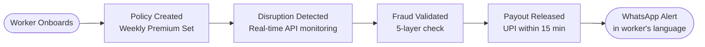

# ZeroRukawat — Zero Disruption to Your Earnings

> AI-powered parametric income insurance for Amazon & Flipkart delivery partners.
> Automatic payouts when external disruptions stop them from working — no claim filing, ever.

---

## The Problem

Amazon and Flipkart delivery partners work on a **batch slot system**. When disruptions hit — rain, heat, curfews, strikes — their entire batch is cancelled. Income goes to **zero**. No compensation. No safety net.

- 20–30% of monthly income lost during disruption periods
- Average savings: Rs 2,000–3,000 (less than 4 days of earnings)
- Zero existing income protection products for this segment

---

## Our Solution

Worker signs up once. Pays a weekly premium of Rs 49–99. When a disruption threshold is crossed, ZeroRukawat automatically detects it, validates the worker was not working, and credits 70% of their lost daily income to their UPI — within 15 minutes.

**No claim form. No waiting. No friction.**

---

## Persona & Scenarios

**Persona:** Amazon & Flipkart delivery partners only — chosen because income loss is binary (batch cancelled = Rs 0), making parametric triggers clean and fraud-resistant.

| Worker | Tier | City | Disruption | Premium Paid | Payout Received |
|---|---|---|---|---|---|
| Raju | Bronze | Delhi | Heavy rain — batch cancelled | Rs 49/week | Rs 448 |
| Priya | Silver | Mumbai | Local curfew — zone deactivated | Rs 79/week | Rs 756 |
| Suresh | Gold | Bengaluru | Warehouse strike — no pickup | Rs 99/week | Rs 546 |

In each case: disruption detected → GPS idle confirmed → platform log checked → payout credited automatically. Worker did nothing after signing up.

---

## Weekly Premium Model

| Tier | Weekly Earnings | Weekly Premium | Max Payout | Coverage |
|---|---|---|---|---|
| Bronze | Up to Rs 4,000 | Rs 49 | Rs 2,450 | 70% of lost income |
| Silver | Rs 4,000–Rs 7,000 | Rs 79 | Rs 3,850 | 70% of lost income |
| Gold | Rs 7,000+ | Rs 99 | Rs 6,300 | 70% of lost income |

**Payout formula:** `(Weekly earnings ÷ 5 days) × 70% × disrupted days`

**AI adjustment:** XGBoost model adjusts premium ±20% based on city weather risk and delivery zone history. High-risk zones pay more. Low-risk zones pay less.

**Compound disruption rule:** One payout per calendar day. Same `ZONE_DATE` Event ID prevents double payment.

**Cold start:** New workers assigned city median baseline for 2 weeks, then real platform data takes over from Week 3.

---

## Parametric Triggers

All triggers are geo-fenced to the worker's delivery zone. Payout fires only when the external event AND worker inactivity are both confirmed simultaneously.

| Trigger | Threshold | Data Source |
|---|---|---|
| Heavy rain | Rainfall > 15mm/hr | OpenWeatherMap + IMD |
| Extreme heat | Temperature > 43°C | OpenWeatherMap + IMD |
| Dense fog | Visibility < 100m | OpenWeatherMap |
| Severe pollution | AQI > 300 | CPCB API (mock) |
| Local curfew / bandh | Zone movement restricted | Govt advisory + crowdsourced |
| Warehouse strike | Hub status = CLOSED | Platform API (mock) |
| Zone closure | Zone status = INACTIVE | Platform API (mock) |

Google Maps Traffic API acts as secondary validation — confirms roads are genuinely disrupted.

---

## Platform Choice

**Progressive Web App (PWA) + WhatsApp Bot**

- **PWA** — Single React codebase. Installable on Android home screen. No app store needed. Works offline.
- **WhatsApp Bot** — Worker onboarding and notifications. Zero app download. Works on any Android. 6 regional languages. Under 5 minutes to sign up.
- **Admin dashboard** — Desktop web for fraud review, disruption map, analytics, and payout management.

We chose PWA over native mobile app to ship faster on a single codebase without sacrificing the mobile experience workers need.

---

## AI / ML Integration

| Model | Algorithm | Purpose | Output |
|---|---|---|---|
| Risk Scorer | XGBoost | Dynamic weekly premium | Premium ±20% per worker |
| Disruption Detector | Threshold monitor | Auto-trigger monitoring | Trigger YES/NO per zone |
| Fraud Detector | Isolation Forest | Anomaly detection | Fraud score 0–1 |
| Income Estimator | Linear Regression | Calculate exact payout | Daily income baseline (Rs) |

**Fraud runs 5 layers sequentially:** GPS idle → platform delivery log → traffic check → duplicate Event ID (Redis cache) → Isolation Forest score. All 5 must pass for payout to release.

**Hyper-local pricing example:** Silver tier worker in Noida Sector 62 (low flood risk) pays Rs 67/week. Silver tier worker in Mumbai Kurla (high flood risk) pays Rs 91/week. AI makes the difference — not flat rates.

---

## Tech Stack

| Layer | Technology |
|---|---|
| Frontend | React + TailwindCSS + Vite PWA Plugin |
| Multilingual | react-i18next (Hindi, English, Tamil, Telugu, Marathi, Kannada) |
| Backend | FastAPI (Python) |
| Database | PostgreSQL + Redis |
| Task Queue | Celery + Redis (API polling every 15 min) |
| ML | XGBoost, scikit-learn (Isolation Forest, Linear Regression) |
| Weather / Traffic | OpenWeatherMap + IMD + Google Maps Traffic API |
| Payments | Razorpay test mode (UPI simulation) |
| WhatsApp | Twilio WhatsApp Sandbox |
| Notifications | Firebase Cloud Messaging |
| Hosting | Render (free tier) + GitHub Actions CI/CD |

---

## Development Plan

**Phase 1 — March 4–20**
Ideation, README, system design, DB schema, API contracts, wireframes, 2-min strategy video.

**Phase 2 — March 21–April 4**
Worker registration + KYC flow, WhatsApp bot (Twilio), XGBoost premium model live, 3–5 disruption triggers firing, zero-touch claims flow, Razorpay payout simulation, 2-min demo video.

**Phase 3 — April 5–17**
Isolation Forest fraud model, GPS spoofing detection, worker + admin dashboards, PWA mobile setup, disruption simulator for demo, Tamil/Telugu/Marathi/Kannada UI, 5-min final demo video, pitch deck PDF.

---

## Additional Notes

**Regional language support:** Hindi + English from day one. Tamil, Telugu, Marathi, Kannada in Phase 2. Bengali and Gujarati on roadmap. Every touchpoint — WhatsApp, web app, notifications — respects the worker's language preference.

**Business sustainability:** At 10,000 workers across diversified cities, weekly premiums of Rs 7.4L cover expected claims of Rs 5.49L — ~15% operating margin. Geographic risk pooling, AI premium adjustment, and reinsurance for catastrophic events keep the pool viable.

**Data privacy:** GPS collected only during active disruption windows. Explicit DPDP Act 2023 consent at onboarding. Workers can delete their data via `DELETE-MY-DATA` WhatsApp command.

**Coverage scope:** Income loss only. No health, accident, life, or vehicle coverage — anywhere in the product.

---

## Team

| Name | Role | GitHub |
|---|---|---|
| | | |

---

*ZeroRukawat — Zero Rukawat. Zero Disruption.*
*Hackathon Submission — Phase 1 | March 2025*
