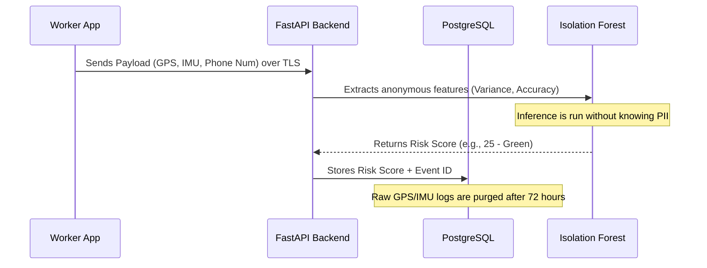

# Data Privacy & Security

ZeroRukawat handles sensitive delivery partner data, specifically real-time GPS coordinates and financial parameters (UPI). Trust is our core product. To comply with India's DPDP (Digital Personal Data Protection) Act and ensure data security, the following protocols are enforced.

## 1. Compliance with the DPDP Act (India)

The platform is mapped explicitly to DPDP principles:

*   **Purpose Limitation & Data Minimization:** 
    *   *Implementation:* GPS data is only actively polled and evaluated during designated *active disruption events* (e.g., when a rainstorm is flagged by external APIs). The Worker app acts as a 'sleeper' agent during normal, sunny days relying only on their static registered `Zone`.
*   **Notice and Consent:** 
    *   *Implementation:* Onboarding via the Twilio WhatsApp bot requires an explicit "I Agree" response to simple, localized (Hindi/Tamil/etc.) terms of service before the premium engine calculates the first risk score.
*   **Right to Erasure (Forget Me):** 
    *   *Implementation:* Workers can text "Clear My Data" or select the option in the app. This triggers a Celery task that scrubs all PII from the `workers` table within 14 days, converting the record to a randomized UUID mapping to preserve aggregate analytics (like total claims paid) without retaining identity.

## 2. Infrastructure & Storage Security

*   **Encryption at Rest:** All Postgres databases (storing PII and UPI Details) are encrypted at the EBS volume layer (AES-256).
*   **Encryption in Transit:** All traffic between the Worker App (React Native), the Backend (FastAPI), and Admin Dashboard (React) occurs over TLS 1.3.
*   **Database Isolation:** Financial data (UPI IDs, premium status) are separated from the high-throughput `disruptions` and `claims` tables logically and via restricted PostgreSQL roles.

## 3. Data Flow & Anonymization Lifecycle

*   **72-Hour Purge Rule:** Raw telemetry logs (exact lat/long, accelerometer ticks) used by the Isolation Forest are aggressively aggregated and purged within 72 hours of a claim resolution. Only the anonymized `ml_fraud_score` and the final `status` are retained permanently for financial auditing.

## 4. Admin Access Controls & Audit Logging

*   **RBAC (Role-Based Access Control):** The React Admin Dashboard enforces strict roles.
*   **Data Masking:** 'Reviewer' level admins handling 'Amber' and 'Red' flags see only obfuscated data (e.g., Phone: `+91 ****** 4321`, Name: `R*** K****`). Full PII is only accessible by 'Super Admins' for legal compliance or critical support escalations.
*   **Audit Trails:** Every view or modification of a claim by an Admin is logged in an immutable `admin_audit_logs` table (Timestamp, Admin ID, Action, Claim ID) to prevent internal abuse.

## 5. Third-Party Data Sharing

We minimize data shared with our infrastructure partners:
*   **Twilio (WhatsApp):** Receives phone numbers and pre-approved template messages. No financial data is sent via WhatsApp.
*   **Firebase Cloud Messaging (FCM):** Used for push notifications. The API only sends opaque tokens and generic messages ("New Alert in your Zone"), never PII or claim amounts in the push payload.
*   **Razorpay:** Receives the UPI ID and the calculated payout amount over their secure API. They do not receive worker location data or ML risk scores.
