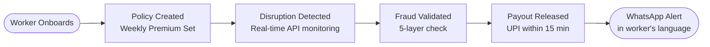

# Design & Architecture

This document holds the core architectural and design philosophies for ZeroRukawat.

## Architecture Flow

## Platform Choice Reasoning
- **Worker App (React Native):** Needed for resilient background push notifications and offline caching for delivery partners using low-end Androids. PWA is insufficient for this use case.
- **Admin Dashboard (React Web):** Data-heavy tasks (fraud review, heatmaps, analytics) require large screens and desktop performance.
- **Onboarding (WhatsApp Bot):** Zero friction for initial signups. Pre-installed everywhere.

## UI / UX Aesthetics & Philosophy
- **Rich Aesthetics:** Ensure a premium, modern feel. Avoid generic colors.
- **High Contrast:** Important for delivery drivers in sunlight and for clear dashboard visibility. 
- **Micro-animations:** Keep the interface feeling alive and responsive (e.g., on hover or loading states or payment success screens).
- **Typography:** Use modern web fonts like `Inter` or `Outfit` instead of browser defaults.
- **Multilingual Support:** Always consider UI spacing for different language lengths (Hindi, Tamil, etc.).

## Adversarial Defense Design (UX)
- Any flagged claims MUST have tailored UX.
- Amber Hold (Score 41-60): Inform worker of network issue (soft hold).
- Red Review (Score 61-85): Inform worker of human review, offer optional photo upload.
- Block (Score 86-100): Clear explicit rejection reason and an `APPEAL` flow.
